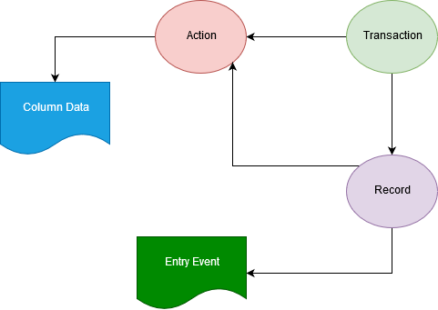

Introduction
============

Redux, unlike any other `Container` implementation that is 
focused on *Dependency Injection* and/or  *Inversion of Control*, 
is a **state** Container for *JavaScript* applications.

Installation
-------------

It is fairly easy to install the package either using **`yarn`* or 
*`npm`*.

```javascript
npm install --save redux
```

There are other possible ways to install the library but using a 
*Package Manager* is probably the best approach if one is looking 
at *re-usability8*.

Why Redux
----------

Below is a small *Mind Map* that demonstrates our idea as can be seen at 
an abstract level for our *Architecture Conceptual Framework*.



There are two issues with the *model* shown above:

- It depicts cycles looking at it in design perspective
- No clear way to manage the `Resource` and `Payload` objects (State)

At this very moment we have no interest as to how the `Payload` objects 
get to be persisted. What we want to do is to make sure that the Transaction 
model itself is reliable first in dealing with the data itself.